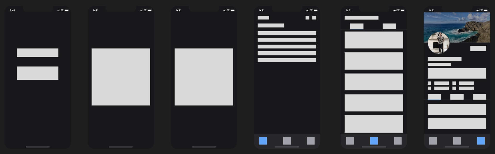
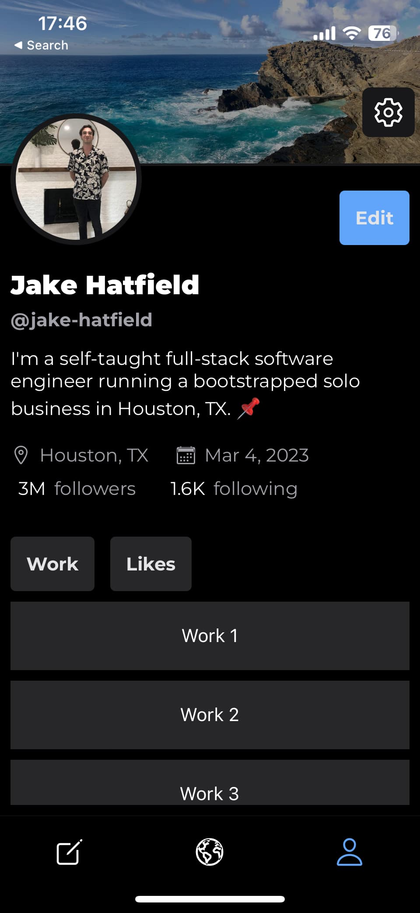

I've been chipping away at <Link href="https://github.com/jake-hatfield/doom-scheme" isExternal isUnderlined title="Doom Scheme"/>. I'm not under any pressure to release this, as I don't really expect to monetize it and it's a purely personal project. So, I'd like for it to be a pretty polished app when I publish it. That said, the work I did today to kick things off was pretty broad-strokes.

## Added

- A README to the repo
- _Rough_ wireframes in Figma for most major screens of the app

<Lightbox description="Figma wireframes">
    
</Lightbox>

## Updated

- The profile screen in the app with static data. Previously it was just a screen that displayed "Profile."

<Lightbox description="Profile screen">
    
</Lightbox>

<CTA/>
