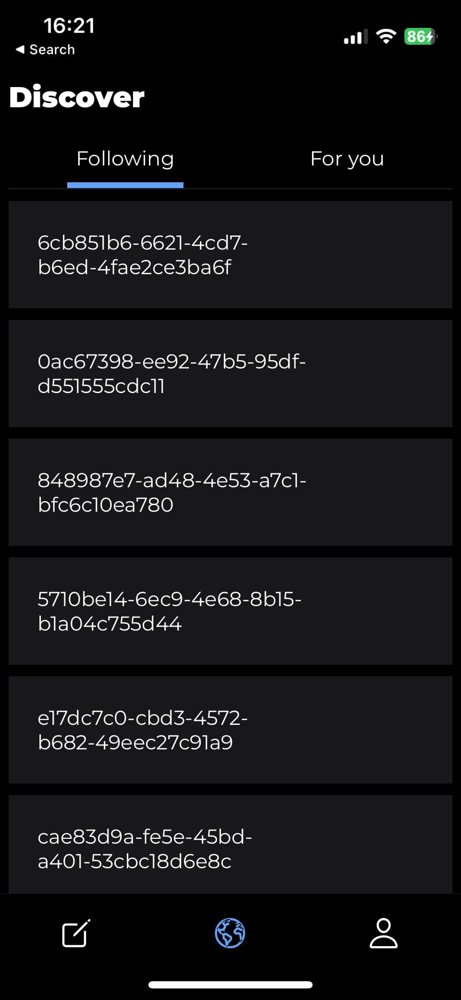
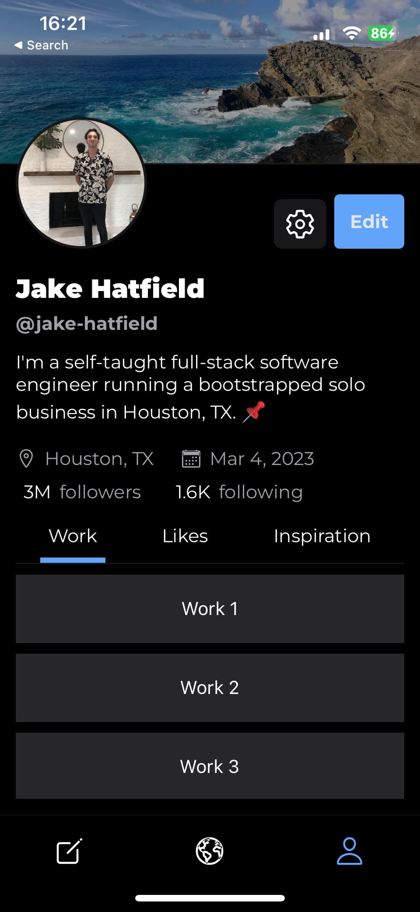

Not an insanely productive day with applications and studying at the same time, but I was able to get some testing set up for Doom Scheme and worked a bit on the UI. It's following the wireframes from [v0.0.2](./0.0.2) pretty closely, which I'm happy about.

I think tomorrow, I'd like to build a rough version the "Composition" screen, which is the real 🥩 of the app.

## Added

### Doom Scheme

- Created a `MultiTab` component to select different states on a screen
- Set up unit testing capability with Jest and `react-test-renderer`
- Tested 6 functions in the `dateTime` util file
  - `convertIsoToMillis`
  - `convertMillisToIso`
  - `formatDateTimeDifference`
  - `formatIsoToText`
  - `formatTimestamp`
  - `getDateTimeDifference`

## Updated

- The Discover screen for viewing and liking shared raps. Previously it was just a screen that displayed "Discover."

<Lightbox description="Discover screen">
    
</Lightbox>

- The Profile screen with the `MultiTab` component

<Lightbox description="Profile screen">
    
</Lightbox>

<CTA/>
