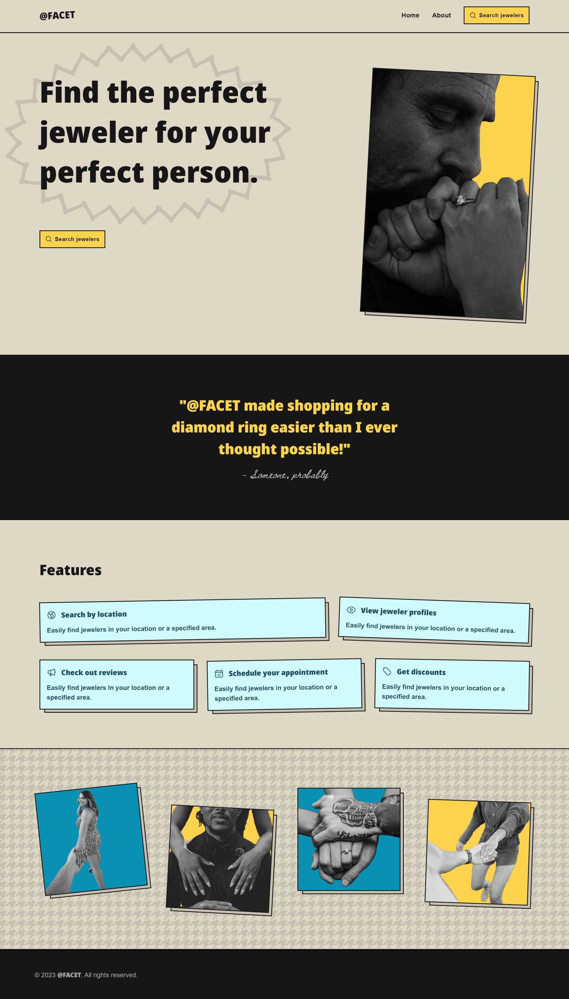

## Summary

@FACET is a site that helps people find the right local jeweler for their loved ones. I put v1 together in 2 days, from idea, to design and implementation.

## Goals

This was a project I used to teach myself Angular and Python + Django. It's a work in progress, but mission accomplished - I'm familiar with these technologies now.

## Tech stack

- TypeScript
- Angular
- TailwindCSS
- Python
- Django
- PostgreSQL

## Overview

This is a pretty simple site. It consists of a home page, an about page, and cities pages with jeweler listings.

## Showcase

<Lightbox description="Home page">
    
</Lightbox>

<Lightbox description="Customer gallery">
    
</Lightbox>

## Wrapping up

I took a few days to familiarize myself with the technologies I wanted to learn, and I'll keep plugging away at adding features and improving my knowledge here.
