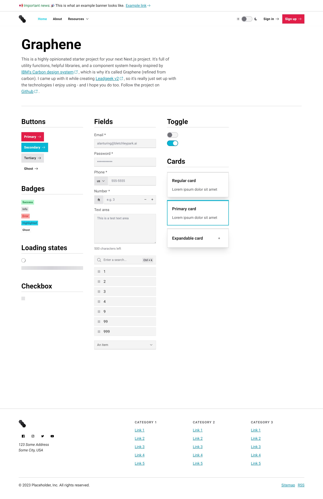
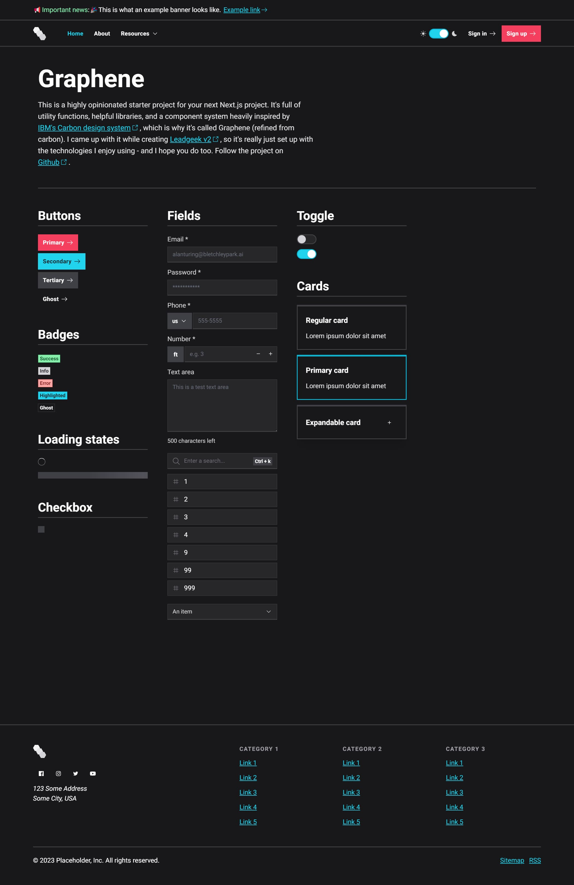

## Summary

This is a highly opinionated starter for your next Next.js project. It's full of utility functions, helpful libraries, and a component system heavily inspired by <Link href="https://carbondesignsystem.com/" isExternal isUnderlined title="IBM's Carbon design system"/>, which is why its called Graphene (refined from carbon).

I came up with it when creating <Link href="https://leadgeek.io" isExternal isUnderlined title="Leadgeek v2"/>, so it's really just set up with the technologies I enjoy using. I've found what works well for me, and I ported it over from SvelteKit to Next.js so I and others could build with these technologies.

## Goals

I wanted to learn Next.js. I hadn't touched React.js since using the MERN stack in the [Leadgeek v1 app](./leadgeek-v1-app) and I wanted to refresh my knowledge of the library while also creating something useful for other people. Therefore, my first thought was to open source a starter.

I was already pretty familiar with the concept of server-side rendering (SSR) in Next.js since I built the [Leadgeek v1 site](./leadgeek-v1-site) with Gatsby.js and [Leadgeek v2](./leadgeek-v2) and [Transform Writing](./transform-writing) with SvelteKit.

In my opinion, `SvelteKit > Next.js > Gatsby.js`, but I still wanted to learn Next.js in case I needed a solid, reliable, and scalable production project. SvelteKit's greatest weakness is that the framework is still young, and introduces breaking changes often.

## Results

It was really easy to pick up Next.js, just as I expected. This wasn't a challenging project, but it helped me stay "warm" on React and built something useful in the process.

I don't intend to do any marketing, organic or otherwise, for the starter. If people stumble upon it and want to use or contribute to the repo, that's totally fine with me.

The initial release of the starter ended up being 28+ components, a blog, dynamic Open Graph images, a Github Actions CI workflow, light/dark mode, utility functions, and my preferred libraries.

I'll likely add more components, functions, and tests over time to keep this starter up-to-date with components I build in other frameworks, as long as they'd fit into the Graphene design system.

<Lightbox description="Light mode">
    
</Lightbox>

### Design system

Speaking of design systems, Graphene was really fun to think about. My first experience in building a design system was trying to make the [v1 site](./leadgeek-v1-site) and the [v1 app](./leadgeek-v1-app) cohesive, and I think my ability to build a library has come a long way since then.

Although I love and use TailwindCSS for nearly all my projects, its biggest weakness is the ability to theme on a greater scale. Meaning, if you want to change the primary color of the project from red to blue, you need to perform a search and replace for all instances of that color.

I'd like to still use TailwindCSS because of its Golden ratio guidelines on spacing, font size, etc., but I think I'll eventually refactor Graphene to have global variables. This would make it more useful as a starter and instantly productive to pick up.

## Tech stack

- TypeScript
- Next.js
- TailwindCSS
- Supabase
- Stripe
- SendGrid
- Twilio
- Sentry
- Vitest
- Playwright
- Vercel (not required, but intended)

I've used this stack in a few other projects and love my productivity with it.

### Databasing and auth

You could swap Supabase for Firebase (and I do in [Doom Scheme](./doom-scheme)), but I prefer the open-source nature, relational database, and data ownership aspects of Supabase.

### Stability

The Stripe, SendGrid, and Twilio APIs are all extremely easy to use and well documented. These are likely candidates to be future-proof and solid pieces of technology.

## Overview

The starter is a simple one-page website to showcase the mobile-responsive and customizable component system. Those components include:

- Header
- Footer
- Modal
- Badge
- Button
- Card
- Checkbox
- Divider
- Highlightable text
- Input
- Link
- Search input
- Loading spinner
- Loading skeleton
- Testimonial
- Text area input
- Toast notification
- Toggle
- Tooltip
- Stripe Elements input
- Dropdown shell
- Dropdown list
- Table
- Open Graph image

## Showcase

### Product

<Lightbox description="Dark mode">
    
</Lightbox>

## Wrapping up

Graphene has been fun to throw together, and I'll keep chipping away at the functionality over time.

I've been most recently building [Doom Scheme](./doom-scheme), which is a React Native app that uses OpenAI's GPT-3 to help compose and share your next rap verse.
