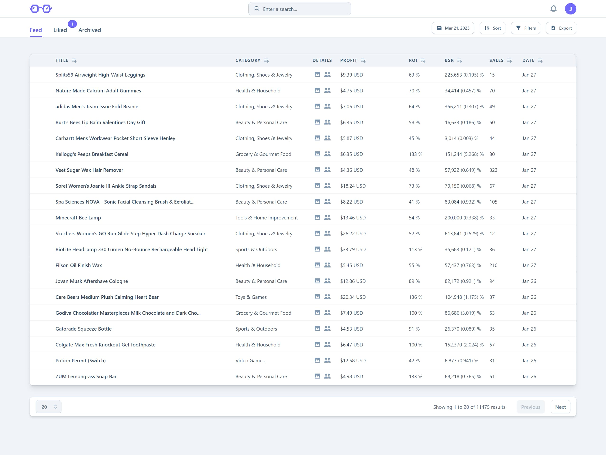
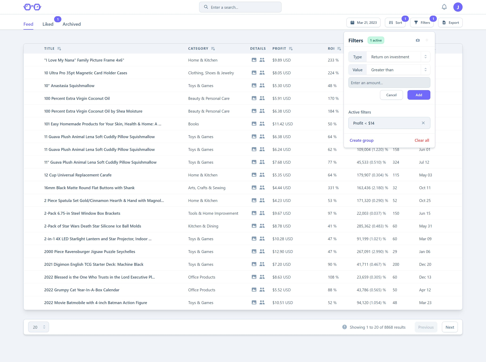
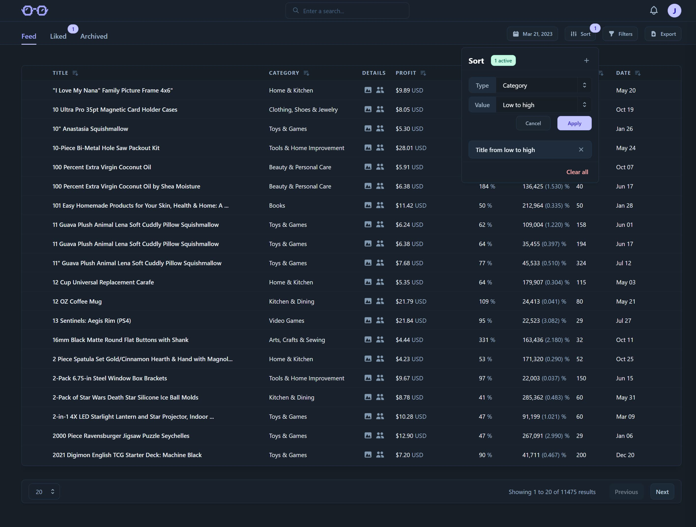
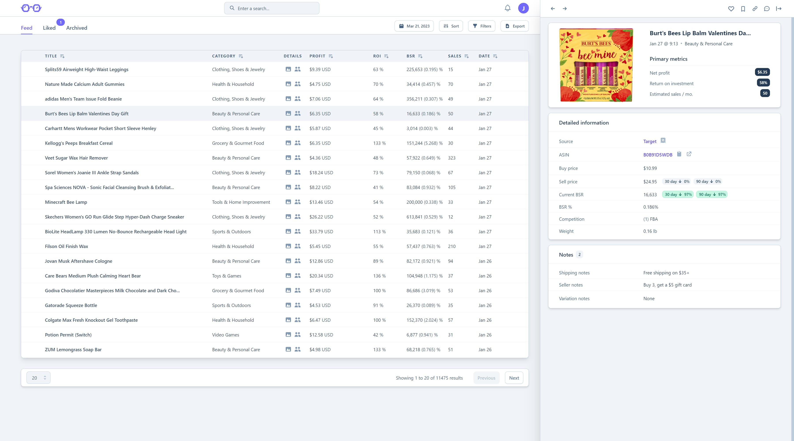
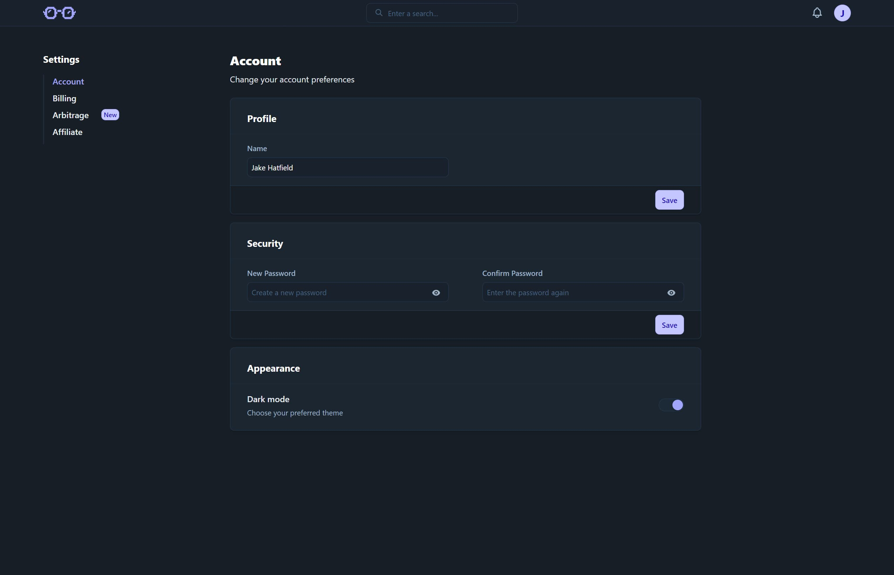
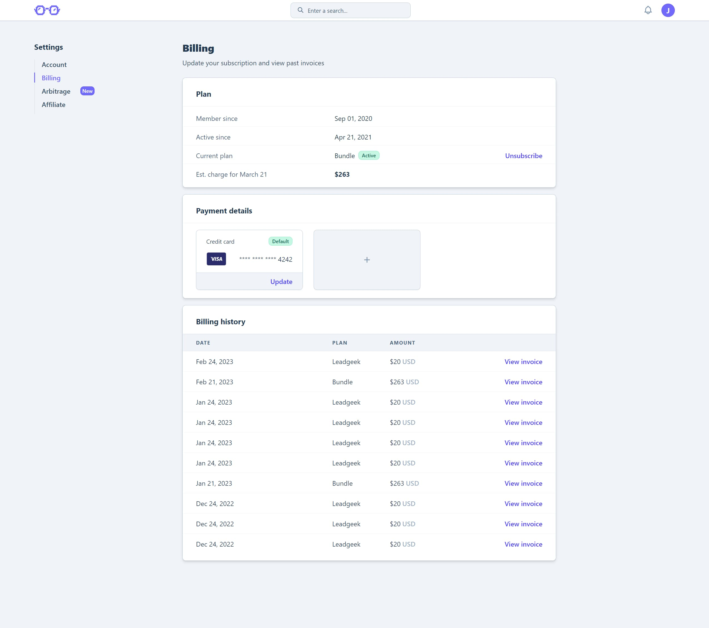
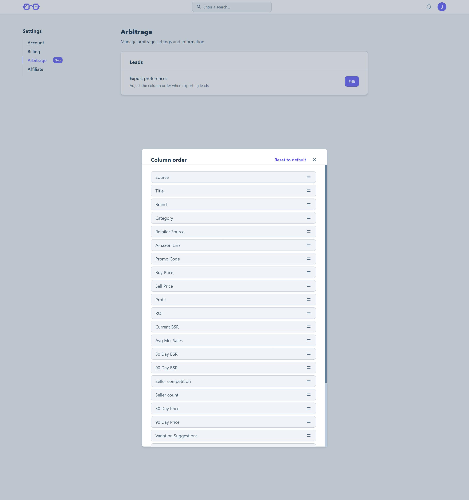
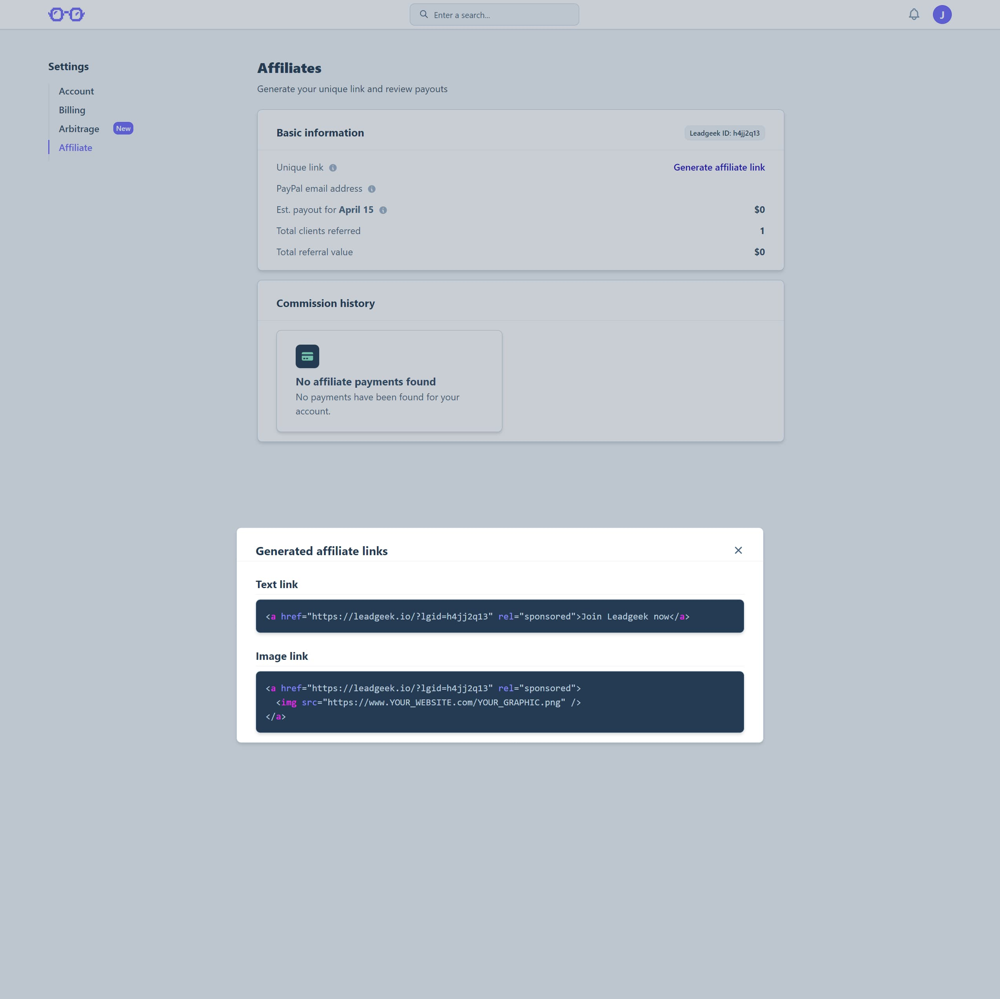

## Summary

This was Leadgeek's core product for nearly 2 years, which is an <Link href='https://leadgeek.io' isExternal isUnderlined title='online arbitrage sourcing list'/> for Amazon sellers. Each day, product research from retailers was compiled and provided to people flipping products via Amazon's 3rd party fulfillment program.

> This project hasn't been in production since Q1 2023, as [Leadgeek v2](./leadgeek-v2) has replaced it. Code for this project is in a private repository in <Link href='https://github.com/jake-hatfield' isExternal isUnderlined title='my Github'/>, and is available upon <Link href='mailto:me@jake-hatfield.com' isExternal isUnderlined title='request'/>.

## Goals

My vision for this project was really simple: my potential competitor's products were overwhelmingly low-quality, clunky, and malformed spreadsheets. I saw an opportunity to improve an already-profitable niche and provide small businesses with a superior, modern solution.

At the time, however, I didn't have any full-stack engineering experience. My _own product_ being marketed by this project's companion, the [v1 site](./leadgeek-v1-site), was a Google spreadsheet.

My knowledge was limited to building a small handful JAMstack websites. I didn't really know where to start, so I just started Googling and learned along the way.

All I really knew was that I wanted to build a subscription-based, login-protected web app that could display the information from my spreadsheet in a more helpful and intuitive way.

Since the main benefit of products like mine are to save clients time, I wanted to create personalizations that would maximize that and set me apart from competitors. I knew that if I could build a tailored experience and set my price point competitively, I would be able to get a foothold into the niche.

## Results

The success of Leadgeek can be completely attributed to this web app. It served over 420 customers in the nearly 2 years it was active and provided an amazing full-stack experience. Not only did it provide a challenging project to work on for 14 hours every single day, but it generated $130k+ from the starting point of a big fat $0.

I was able to communicate directly with my customers and provide specifically asked-for customizations that made their Amazon selling process better. I really enjoyed making people happy and helping them succeed.

What particularly stood out as a learning experience with this project is how to maintain a code base. It's one thing to make an app to learn a new framework, it's another thing if it serves paying customers, and it's another thing entirely to maintain it over the long-term, especially solo.

I didn't know how to build something like this when I started, and I had to overcome technical debt from past decisions as a result. Namely, refactoring from JavaScript to TypeScript, but also with things like my RESTful API (ya ever just make every request a `POST` request because you don't really know that there are other kinds until much later? That was a nice rework).

As a result, I learned much more quickly on subsequent projects how _not_ to do things and what infrastructure decisions to make instead.

## Tech stack

- TypeScript
- React
- Redux
- Node.js
- Express.js
- MongoDB
- Mongoose
- TailwindCSS
- Stripe
- Heroku

I used the MERN stack for this project simply because there were a lot of free resources available to learn from. At the time, it would have been impossible for me to do a constructive analysis on which stack to go with, so I decided on the most learnable.

Now that I have a lot more full-stack experience, this isn't necessarily what I would choose again. But at the end of the day, the MERN did what I needed.

### Overview

This was the basic flow for users:

1. Signing up on the v1 site creates a Stripe customer, a new subscription for the chosen plan, a Mailchimp contact, and an email/password credential set in MongoDB, using schema built by Mongoose.
2. The web app (`app.leadgeek.io`, now archived) would allow you to access your product leads, which have been verified, vetted, and uploaded from an admin-only Google sheet.
3. Leads can be sorted by 7 fields and stack with each other. For instance, leads can be sorted by "title" high → low and then "profit" low → high. Leads can also be filtered to only show matches to minimum or maximum preferences. Being mindful of creating an accessible, consistent experience, lead sorting and pagination occur server-side.
4. Leads in the "Feed" can be inspected in the detailed view, where further information about the lead is provided. There, you have the option to perform frequently used actions with hotkeys and leave a persistent note about the lead. You can also provide feedback about a lead here, which is sent to a Slack channel via webhook.
5. The ability to "like" leads you intend to purchase or research further and "archive" leads you've already purchased help structure your workflow.
6. To provide flexibility to customers used to the spreadsheet system, you can still export leads into `.csv` format from the Feed.
7. Leads are fuzzy-searchable globally from the header navigation. You can search by lead title, source title, or Amazon Standard Identification Number (ASIN).
8. A notification system allow admins to push updates to users individually or globally.
9. Your preferences can be managed in the settings pages:
   - `/settings/account` for contact info, password resets, and appearance (e.g. dark mode)
   - `/settings/billing` to update your subscription and view past invoices
   - `/settings/arbitrage` to update your selling preferences, namely your preferred column order in the exported `.csv`
   - `/settings/affiliate` provides you with your unique affiliate link and shows your commission history

### Security and auth

Something I was always mindful about was security. Naive little Jake rolled authentication himself, which is not a decision I would make in the future - though I learned a ton about security best practices by doing it.

User-created passwords are hashed and salted with 10 rounds, so no raw password was stored in my database. On successful email/password login, a 5-day expiry JWT secured with a 256-bit hashing algorithm is stored in the client's request header, `x-auth-token`.

The reset password logic was also implemented from scratch. If a user requests to reset their password, a lookup in the database by email is performed. If a user is found, a reset password token with a 1-hour expiration is generated.

I send the user an email via Nodemailer containing a link to the `reset-password` page with the token appended as a URL query. On the password reset page, the token is grabbed from the query and verified in the database. Then, the user can only reset their password if the token is valid and they're shown a "Sorry, you'll need to request a new reset..." message if invalid.

### Affiliate system

Pre-built affiliate tracking systems charge fat commissions on top of what you're already paying your affiliates. Therefore, I decided to cut out the middleman and opted to create Leadgeek's affiliate system myself.

Once it was ready, I plugged it into the [v1 site](./leadgeek-v1-site) as the entry point. I ended up using a slightly re-worked variation for [v2](./leadgeek-v2) that simplified the system a bit, but it generally looked like this:

1. Affiliates must apply via the v1 site.
2. If approved, affiliates are assigned a unique Leadgeek ID, `lgid`.
3. An affiliate referring someone to the v1 site with their `lgid` in the URL query results in a 90-day cookie being stored in the referred user's browser. Once an `lgid` cookie has been created, it can't be overwritten. This is so that first-touch referrers are attributed.
4. If the referred user signs up for a subscription, I perform a lookup for the affiliate based on the value stored in the `lgid` cookie.
5. Once the subscription payment is successfully processed, I store the referred customer's now-generated MongoDB UUID and Stripe customer ID as an object entry in the referrer's `clients` array and update the referral's `wasReferred` boolean to `true`.
6. To determine commission value, I simply look up a referrer's client's by ID in Stripe and share 25% of their lifetime value.

The only thing I didn't automate is PayPal payments, which I could have if the volume of affiliates was creating a bottleneck in my productivity. Since it never did, I didn't mess with PayPal's API.

Easy to implement. Scalable. Fun to put together. A win all around.

### Billing system

When I came to handling billing data, I really wanted to take a hands-off approach for 2 reasons:

1. I didn't want to store sensitive data in my database. It can't ever be exposed if I don't ever have it.
2. Since it's a subscription product, I wanted the most recent information about a customer's subscription as possible. I didn't want to chance that the data would get stale in my storage and result in access mishaps.

To solve these problems, I stored only a small amount of information about a customer's subscription:

- Their Stripe customer ID
- Their Stripe subscription ID
- Their Stripe default payment method ID, its last 4 digits and brand

Looking back, I really should have only stored their Stripe customer ID, but the other information isn't sensitive enough to set off alarm bells in point #1 above.

Everything on the billing page is retrieved in real-time via Stripe's API, from their subscription status to their most recent payments and invoices.

It was kind of a headache to implement, but I got more familiar with Stripe's API and it was nice to not have to store sensitive customer data in my database.

## Showcase

### Product

<Lightbox description="The Feed">
    
</Lightbox>

<Lightbox description="Filter leads">
    
</Lightbox>

<Lightbox description="Sort leads (dark mode)">
    
</Lightbox>

<Lightbox description="The detailed view for each lead">
    
</Lightbox>

### Settings

<Lightbox description="The account page (dark mode)">
    
</Lightbox>

<Lightbox description="The billing page">
    
</Lightbox>

<Lightbox description="The arbitrage page">
    
</Lightbox>

<Lightbox description="The affiliate page">
    
</Lightbox>

## Hindsight

Like the v1 site, I originally wrote this in pure JavaScript. It was pain for a while until I refactored to TypeScript later.

There were a lot of ways this project could have been improved, and features could be added, but it got the job done in its current state.

I didn't particularly enjoy working with Redux, and I went through Redux Actions and refactored to Slices, so I have some experience with it. There's just too much boilerplate. Svelte stores are significantly cleaner, and the data flows so seamlessly in Svelte apps that I find myself having to only use them occasionally anyway. All this to say that I'd probably swap Redux for Context if I had to rebuild this project in the MERN stack now.

Now that I have experience with both, I can firmly say that I enjoy working with relational databases over something like MongoDB. One of the most challenging aspects of this project was how to structure my schema in a way that would make sense years from now. I didn't have any experience in this area prior to this application, but I think it would have been more intuitive with a database like Postgres.

I would have added unit and integration tests, but I didn't even know they were a thing when I started, and by the time I was ready to start working with them, I was phasing this project out in favor of the update.

Besides that, I actually don't have many regrets on this project. Of course I would refactor it a bit to be cleaner, and I probably would have chosen Next.js, or better yet SvelteKit (which is what I went with for [v2](./leadgeek-v2)). But I would consider this an overall success 🎉.

## Wrapping up

I learned a _ton_ on this project. While I prefer serverless architectures now, I'm grateful for the experience of building a server from scratch. The MERN stack served me well and was a great venture from 0 backend knowledge into creating a capable RESTful API, and a solid frontend.

I learned how to write webhooks, handle optimizations with things like `useMemo` and `useCallback`, and maintain a project over years for hundreds of paying customers.

The companion project for this is the [v1 site](./leadgeek-v1-site) and its successor is [v2](./leadgeek-v2).
