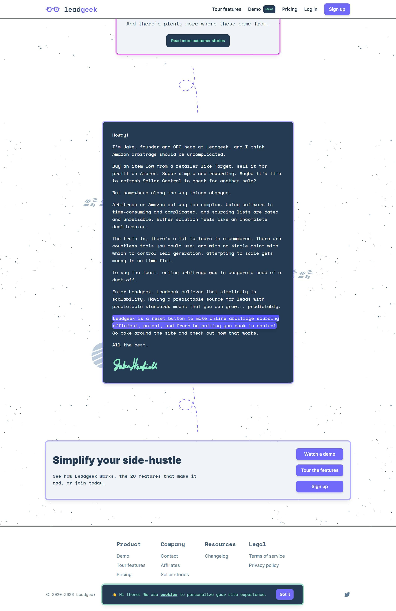
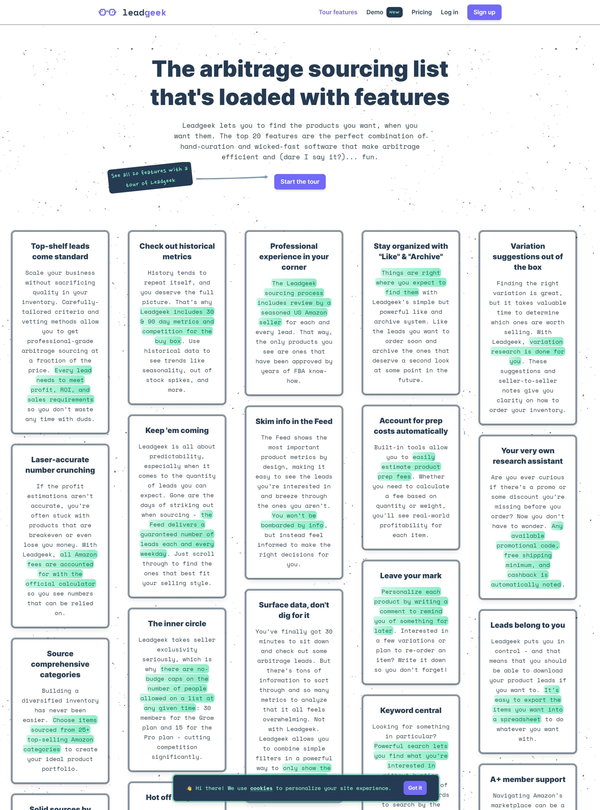
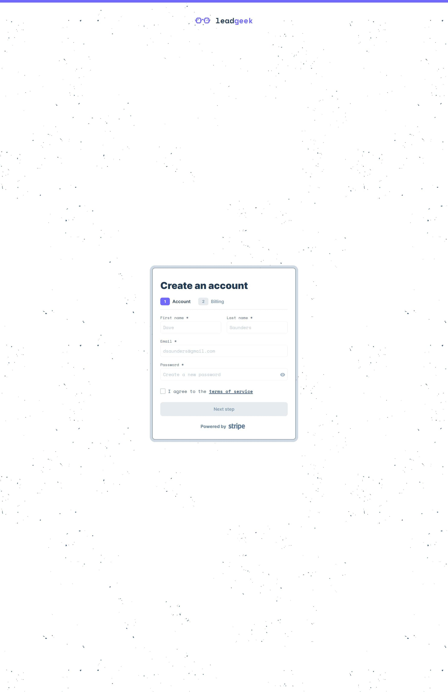

## Summary

This is the marketing website for v1 of Leadgeek's product, which is an <Link href='https://leadgeek.io' isExternal isUnderlined title='online arbitrage sourcing list'/>. Essentially, it's a collection of daily research compiled and vetted for Amazon sellers to flip products from retailers.

> This project hasn't been in production since Q1 2023, as [Leadgeek v2](./leadgeek-v2) has replaced it. Code for this project is in a private repository in <Link href='https://github.com/jake-hatfield' isExternal isUnderlined title='my Github'/>, and is available upon <Link href='mailto:me@jake-hatfield.com' isExternal isUnderlined title='request'/>.

## Goals

Quite simply, I needed to sell stuff. This being my first solo digital product, I wasn't really sure what elements I needed to do that, and I had to figure it out along the way.

v0 of my product was a custom spreadsheet with macros which was populated with that day's Amazon research and emailed to subscribers. I knew when I started Leadgeek that this wasn't final form, but I had to buy a bit of time to build the [v1 app](./leadgeek-v1-app) and I wanted to validate product-market fit.

With this in mind, I knew that everything I built to market the spreadsheet had to be 1:1 transferrable to market the web app _and_ scale an as-of-yet-undetermined amount. Easy 😂.

## Results

I started this business with $500, and grew it to a $70k annual recurring revenue (ARR) machine, before I killed off all my subscriptions in favor of a pay-as-you-go model with [v2](./leadgeek-v2) in Q1 of 2023. I like the grind, what can I say?

Creating this website helped refine my skills as an engineer, especially considering how inexperienced I was when I started building it. Not only did I become more knowledgeable about the technical aspects of building a website, I learned about the non-engineering requirements as well.

I learned how to market, maintain, and run a business. I learned about Google Ads, Open Graph, and copywriting. I learned about taking raw customer input, distilling it to its most concise form, and fleshing out the FAQ section a bit more. I learned that you can attract the kind of customers you want by investing more thought into your product's design. I handled customer support, product development, and daily maintenance simultaneously.

Overall, the experience was very humbling, and I'm extremely grateful that it was able to accelerate my learning to become a well-rounded, cross-discipline software engineer.

Besides what I personally got out of this project, it received some external appreciation as well. Leadgeek was organically chosen as showcase of the week in <Link href='https://tailwindweekly.com/issue-96/' isExternal isUnderlined title='Tailwind Weekly'/> for its unique design.

## Tech stack

- TypeScript
- Gatsby.js
- GraphQL
- TailwindCSS
- Stripe
- Mailchimp
- MongoDB
- Netlify

> **Disclaimer**: I was relatively inexperienced when I put this site together. I would have made some very different decisions if I were to build this project now, but I'm actually quite proud of how it turned out, considering I was an absolute newbie with only Google to help solve problems. I've included it in my portfolio to document where my programming journey started and where I'm at now.

### TypeScript

I didn't know TypeScript when I originally built the site, so it was written completely in JavaScript and refactored later. Yeah, ouch. Ouch for a 100% JavaScript site without tests or error monitoring (I was just unaware these things existed), and ouch for the refactor.

### Gatsby.js

I had previously built a handful of much smaller Gatsby.js projects for myself and some clients, so it was what I had the most familiarity with.

What initially drew me to Gatsby.js in general was the speed and SEO advantages over a pure React site. I knew my data wouldn't have to be highly dynamic, and a less than 3 minute build time to reflect the rare update wouldn't be an issue in such a small niche with low traffic.

Another enormous benefit of going with Gatsby.js, which I'm not ashamed to admit I needed at the time, is that the plugin ecosystem is fairly mature. I knew I was going to need some sort of help to put this project together. Plugins helped me with things I didn't have the bandwidth for, like generating sitemaps, handling SEO, and sourcing the file system.

### GraphQL and MongoDB

GraphQL was essential to get the progressive image enhancements and later query MongoDB.

### TailwindCSS

I chose TailwindCSS because I knew I wanted a unique-looking site, and from what little I knew, TailwindCSS could help me achieve it. I had some experience with MaterialCSS and Bootstrap, but they generated fairly boring projects. Overall, I'm very grateful that I picked this technology here, because this project helped me fall in love with TailwindCSS.

### Mailchimp

I chose Mailchimp primarily because it's affordable and it has the ability to create remarketing automations, but in hindsight, I really wish I had gone a different direction here. More on this later.

### Stripe

This was also the first time I integrated Stripe in a project. It kicked my butt at first. I remember being frustrated because I had to actually read the documentation and it didn't _just work_. How silly of me. My mindset on problems like this has changed so much. But boy, creating a subscription for the first time had me _sweating_ 😅.

### Netlify

I deployed the site on Netlify because it's free and perfect for the JAMstack. Netlify functions are very similar to AWS Lambda functions, and they enabled me to integrate Stripe, Mailchimp, MongoDB, etc. This was my first exposure to serverless functions (and now that I'm thinking about it, my first exposure to backend at all).

## Showcase

### Home page

<Lightbox description="The home page overview">
    
</Lightbox>

<Lightbox description="The home page's hero section">
    
</Lightbox>

<Lightbox description="The home page's testimonial section">
    
</Lightbox>

<Lightbox description="The home page's call-to-action section">
    
</Lightbox>

### Demo page

<Lightbox description="The demo page">
    
</Lightbox>

### Pricing page

<Lightbox description="The pricing page">
    
</Lightbox>

### Features page

<Lightbox description="The feature overview page">
    
</Lightbox>

<Lightbox description="An individual feature page">
    
</Lightbox>

### Sign up page

<Lightbox description="The sign up page">
    
</Lightbox>

## Hindsight

From a business perspective, I made plenty of mistakes.

For instance, I reached maximum capacity for my product in Q2 2022, so I created and opened up a waitlist system. The problem is that I left people on my waitlist too long. Within a few months, I had a 100-person waitlist and nothing to sell them. With my average lifetime value for each customer at ~$600+, I should have tried to increase the capacity for my product while I was developing v2.

Regrettably, I believe 100% that Leadgeek could have had $120k+ ARR. Now that it's not on a subscription model anymore, I guess we'll never know 🤷‍♂️.

I also should have bought the `.com` domain when I had the chance. It was $5k when I launched, and now it's sitting at $20k. I have the `.co` and it's redirecting to the main `.io`, but that one "m" is very expensive.

To be honest, though, I think this is just a vanity thing. The business isn't suffering without the `.com` domain, and there are a lot of places to focus my efforts in the meantime.

From a technical perspective, things I would do differently include:

- Implementing a TypeScript refactor earlier.
- Using Next.js instead of Gatsby.js. The race for the best static framework seemed so much closer years ago, but Next.js really pulled ahead over time. The Gatsby.js build times are comparatively insane in a bad way.
- Pick a tool like SendGrid over Mailchimp. Something as simple as a sign-up confirmation email took as long as 15 minutes to queue up using their API. Ridiculous.
- Use more of a DRY approach to the codebase. I think there was some code re-use that could have been avoided.
- Unit and integration tests are completely lacking.

## Wrapping up

If you compare this project to my recent work, there's been a huge amount of growth in a relatively short time. But this project is one of the main reasons for that growth - I realized how much I enjoy programming for the sake of building cool products.

The companion project for this is the [v1 app](./leadgeek-v1-app) and its successor is [v2](./leadgeek-v2).
