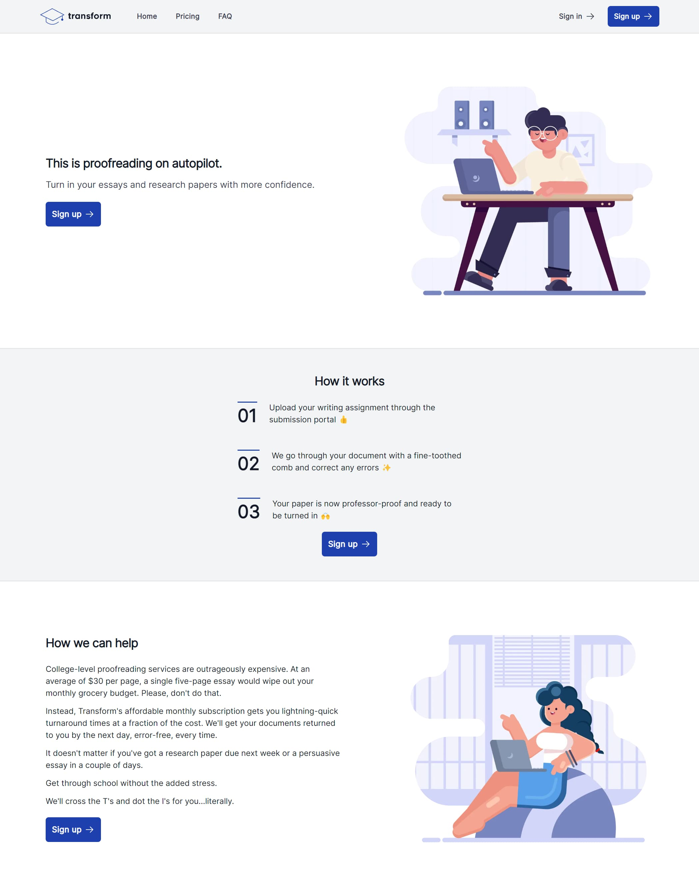
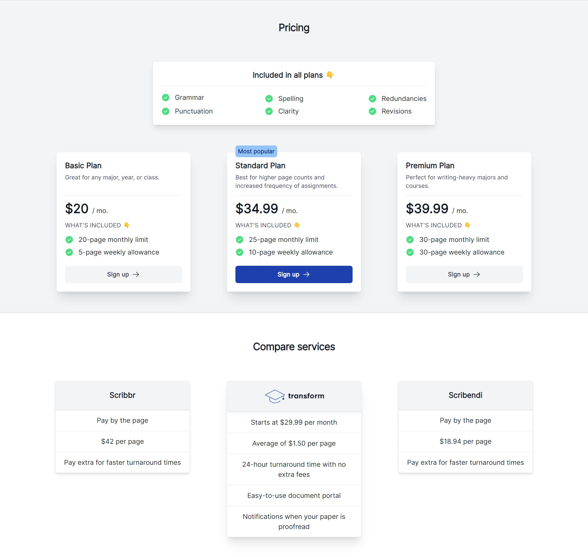
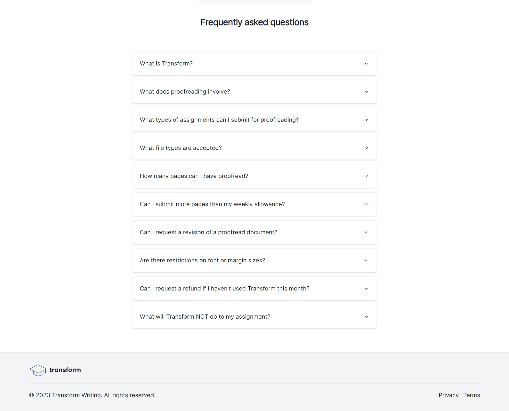
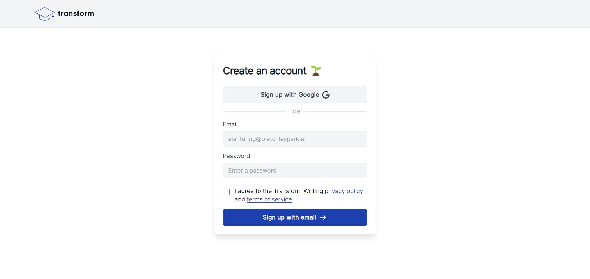
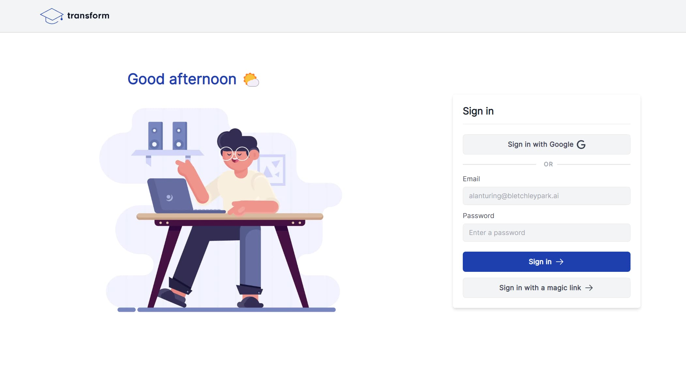
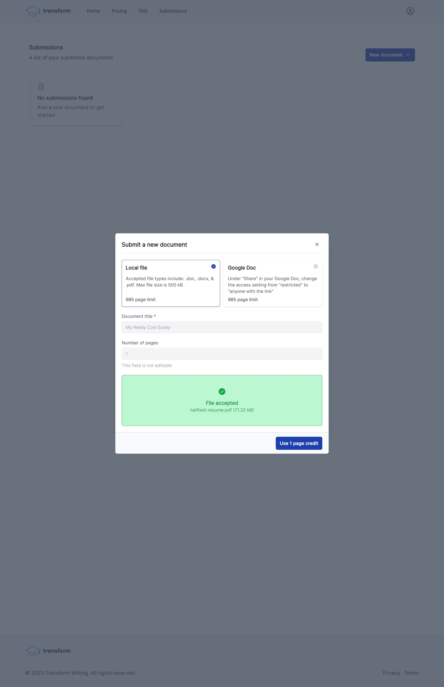
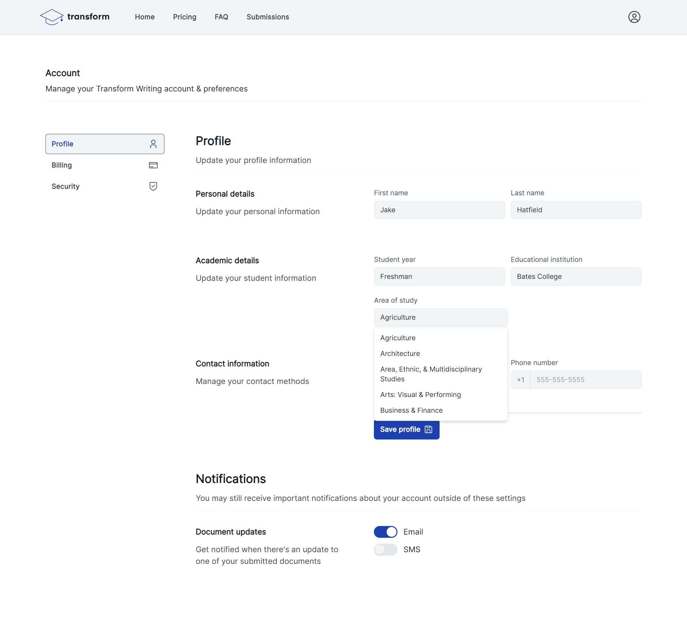
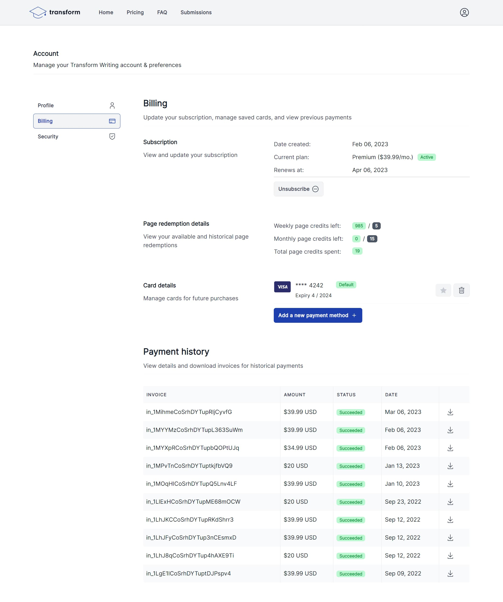
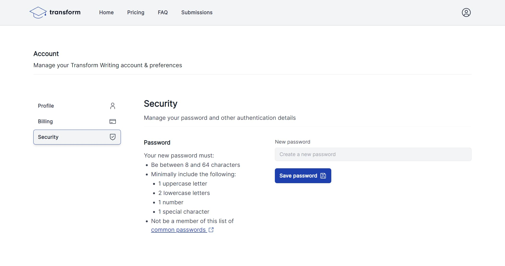

## Summary

This is a software-as-a-service (SaaS) I put together for a client, Sam, in 2022 that helps students submit their essays for proofreading.

Sam mentioned to me that their current contract development team wasn't close to meeting his vision for the web app, so I offered some advice. That advice ended up with me programming the application myself, which worked out well for both parties.

I had my sights on creating [Leadgeek v2](./leadgeek-v2) in the near future and wanted a chance to build and test a design system from scratch, and he currently had a dev team where the game plan was just to mash together WordPress plugins.

## Goals

Sam's goal for Transform Writing is to have a bit of a side-hustle running in the background as he pursues his full-time career.

He expected for it to take a bit of time to ramp up customer acquisition, so I wanted to build him something that would be inexpensive to maintain but also scale with his growth.

You can read more about the [tech stack](#tech-stack), but I believe the tools that I used to build it is the most optimized, high-quality suite that can be assembled to meet his needs.

## Results

I could write about what I think, but I'd rather just let you know what Sam had to say:

> "During the initial stages of Transform Writing's formation, we encountered challenges with three different website developers who were unable to handle the complexity of the project. I approached Jake with our concerns and inquired whether our expectations for the website were unreasonable.
>
>   Transform Writing is a platform for students to submit their written assignments for proofreading and light editing. Each student must have an account that provides a private upload portal for their documents. The Transform administrators must be able to download the submitted documents and return the proofed version to the respective students.
>    In addition, the website needed a clean and user-friendly interface that would enable first-time customers to navigate easily while enjoying an appealing page design and layout.
>
>    After carefully evaluating the project's requirements, Jake assured me that he could complete the project without any issues. Moreover, he proposed modifications to key functionalities that made the administrative process more efficient.
>
>    For instance, before Jake's revisions, Transform's administrators were required to access each student's account separately to verify submissions and upload/download the relevant documents. However, Jake suggested a more streamlined approach by designing an admin page that consolidates allsubmissions. The administrators can download the documents from a single admin page, eliminating the need to interact with hundreds of account pages.
>
>    Furthermore, Jake established a notification system for both students and Transform's administrators. Students receive updates through customizable text messages or emails, while the admin team receives notifications in their Slack channel whenever a new submission appears in the system. This is a significant breakthrough as it eliminates the need for periodic manual checks, especially since Transform guarantees 24-hour turnaround times to its customers.
>
>    Throughout the development process, Jake proactively sought our input and feedback, which enabled us to make timely revisions and course corrections as required.
>
>    The final product is a remarkable asset to our company, offering unparalleled convenience and efficiency, enhancing customer experience, and maintaining our reputation among existing clients.
>
>    We are confident that Jake will excel in handling similarly complex projects, and we will undoubtedly consult him for any future website development requirements."
>    &mdash; <cite>Samuel Broadbent, Founder of Transform Writing</cite>

## Tech stack

- TypeScript
- SvelteKit
- Supabase
- TailwindCSS
- Stripe
- SendGrid
- Twilio
- Vitest
- Playwright
- Github Actions
- Vercel

I intentionally picked the tech stack I wanted to build [Leadgeek v2](./leadgeek-v2) in. The knowledge and experience I gained on Transform Writing was directly transferrable to being able to create Leadgeek v2 relatively quickly.

### TypeScript and SvelteKit

Prior to working on this project, I had just scrapped a Chrome extension that I had written with Svelte. My goals for that project had changed, so I didn't publish my work on it; however, I fell in love with building things with this extremely modern and succinct framework.

When Sam mentioned that his current developer wasn't working out, I offered to help him. I thought it would be a good opportunity to learn SvelteKit and provide a more polished product than he was expecting to receive with his current team.

While SvelteKit is an amazing tool, and I would use it for any new production project _now_, it probably wasn't the right pick _then_. I write more about why in [hindsight](#hindsight).

### Supabase

I hadn't built a project with Supabase before, but I chose it for 3 reasons:

1. I wanted to learn relational databasing
2. I wanted to offload handling auth
3. It was talked up like crazy by other devs in the community

In the end, I'm really glad I got some experience with it. I think I would choose it for almost every side-project in the future.

### SendGrid and Twilio

Sam requested to have email and SMS notifications for clients and admins when a submitted document was updated. I hadn't worked with either of these services before, but I knew they were pretty much the industry-standard for their respective notification methods.

Their API is easy to pick up and the documentation is great.

## Overview

### Design system

I wanted to take Transform Writing as an opportunity to build my own design system from scratch. In 2022, I discovered IBM's <Link href="https://carbondesignsystem.com" isExternal isUnderlined title="Carbon Design System" />, which I loved for its ease-of-use and versatility.

I'd like to become the best programmer and creator of products I can be, so I figured part of that meant that I need to understand design systems well. Consequently, I built my own variation of Carbon that would later become [Graphene](./graphene).

I learned a lot while putting it all together. For instance, I invested a lot of thought into how to make a component like a button flexible in its capability yet maintainable and coherent in its logic. What `props` should I expose for variations, and what are the most intuitive ones to set for default behavior?

I now use my Graphene design system for all my projects, including this portfolio website. All I really need to do before jumping into an immediately productive workflow is to adjust the way I want my design for that project to look. In other words, I just have to tweak things like button colors and `border-radius`.

I'm really glad I invested the time and effort into my own design system. I feel like it helped me become a better front-end engineer long-term.

### Image enhancements

At the time of this writing, SvelteKit doesn't natively support progressive image enhancements such as a blur-up effect or `.svg` outlining an image on load like Next.js or Gatsby.

Although Transform Writing isn't image-intensive, I wanted it to have a polished feel and prevent content shifting. Therefore, I wrote up my own progressive image enhancement from scratch.

It's not terribly complicated, but I'm happy with the finished product. Essentially, I created an API route that receives the path of the relevant images and returns a low resolution placeholder of that image. As the full-resolution version of the image loads in, you get a blur-up effect.

Under the hood, the `lowResolutionPlaceholder` function uses `sharp` to take a buffer and return a new sub-sampled buffer of 50% reduced quality. In the `+layout.svelte` file, I create a lazy load instance (if there isn't one made already) and load in the full-resolution version after the page mounts.

### Securely handling documents

One thing I love about Supabase is that there are multiple layers of security to protect your database. Of course, it's a given that you want to be careful with your API keys. It's nothing special that you can mandate that operations be performed server-side. But if a malicious actor were to bypass both of these measures somehow, you can still secure your database with row level security policies.

The only database experience I had before this project was with MongoDB, a NoSQL database (which is why I wanted to step outside my comfort zone with this project). Supabase uses Postgres, and therefore we can apply authorization checks directly on the tables of our data.

For instance, for our `profiles` table, we can set it so that only an `admin` has `update` permissions, but an `authenticated` user can read their own data. I love that this not only secures the table itself, but it also cleans up the logic you need in your database calls.

If you want to request a user's information, you don't need to set matching parameters like `id: user.id`. This is handled by your RLS policy - only rows that match the condition you specify (in this case that the requestor's ID matches the row's ID) will be returned.

Supabase, like Firebase, handles databasing _and_ file storage, so I applied these RLS policies to data in my tables and also user-uploaded documents. I know a college essay isn't necessarily the most sensitive piece of information, but I didn't want to slack off in security best-practices.

Docs are kept secure and links to access them require the use of signed URLs. Therefore, their access links are no longer valid after a specified amount of time.

## Showcase

### Product

<Lightbox description="The home page's hero section">
    
</Lightbox>

<Lightbox description="The home page's pricing section">
    
</Lightbox>

<Lightbox description="The home page's FAQ section">
    
</Lightbox>

<Lightbox description="The sign up page">
    
</Lightbox>

<Lightbox description="The sign in page">
    
</Lightbox>

<Lightbox description="The submission page">
    
</Lightbox>

### Settings

<Lightbox description="The profile page">
    
</Lightbox>

<Lightbox description="The billing page">
    
</Lightbox>

<Lightbox description="The security page">
    
</Lightbox>

## Hindsight

### SvelteKit

Looking back, I probably wouldn't have chosen SvelteKit for this project. At this point in time, there wasn't a stable release out yet. As a result, there were quite a few breaking changes in the framework and associated helper libraries like the Supabase SvelteKit auth handlers.

Although it ended up being more work in the short-term to update the routing or SSR syntax, it really helped me understand 2 things:

1. How to be proficient in SvelteKit, specifically
2. How to consider, weigh, decide, and communicate decisions about system architecture

The former I learned by doing, and the latter I learned by observing Rich Harris and the SvelteKit community.

If I could go back in time, I probably would have used something like Next.js for this project, but I learned a valuable lesson about choosing the right (and stable) tool for the job.

## Wrapping up

This project was an amazing experience to be able to build a rock-solid design system from the ground up. I can't state enough how much it allowed me to be able to iterate on [Leadgeek v2](./leadgeek-v2) faster than I should have been able.

I'm also glad Sam was pleased with the finished product. I expect to maintain this code base to some degree in the future to create additional features and landing pages.

Recently, I ported a lot of the code I wrote in this project into a Next.js starter called [Graphene](./graphene). Now, I'm working on a React Native app powered by GPT-3 called [Doom Scheme](./doom-scheme).
